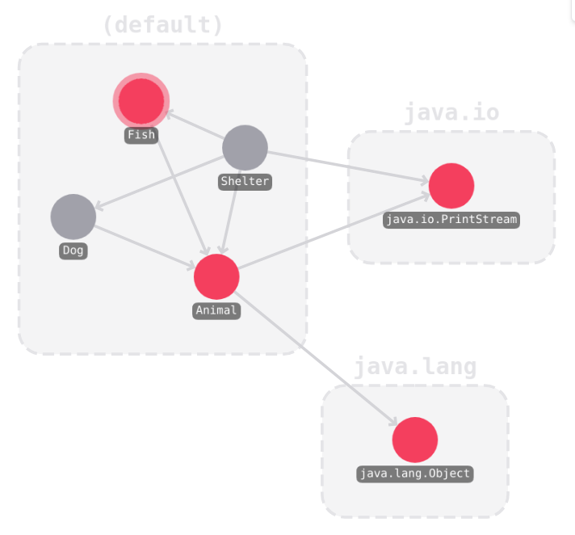
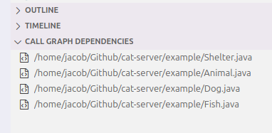
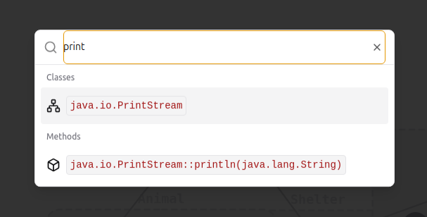

# cat-viz


`cat-viz` is an extension for Visual Studio Code that displays call graphs. It uses [cat-server](https://github.com/trettiofem/cat-server) as its backend, which in turn is based on [CAT](https://github.com/IdrissRio/cat/), a call graph analysis tool created by [Idriss Riouak](https://github.com/IdrissRio). CAT and by extension, cat-server is built on top of the [ExtendJ](https://extendj.org/) Java compiler.

## Table of Contents

- [Features](#features)
- [Installation](#installation)
- [Usage](#usage)
- [Contributing](#contributing)
- [License](#license)

## Features

### Follow the flow of execution

`cat-viz` highlights the flow of execution, allowing the user to get a good grasp of how the analyzed program is structured.



### Zoom in and out

`cat-viz` allows the user to "zoom" in and out of the graph, which shows the relationships, not only between methods, but also between classes and packages.


### Selective analysis

`cat-viz` allows for fine-tuning of its call graph analysis. Analyzing every file in a large project can take a long time to compute, and can result in a very large and unwieldy graph.



### Search

`cat-viz` has a built-in search function, allowing the user to search for methods, classes and packages.



## Installation

```sh
# Clone the repo
gh repo clone trettiofem/cat-viz
cd cat-viz

# Install dependencies
npm install
cd view
npm install
cd ..

```

## Usage

```sh
# Follow the steps below if you are interested in the web view component.
# Navigate into the web view component
cd view

# Start local development server
npx vite

# Build web view
npx vite build

# Run build server
npx vite build --watch

# Follow the steps below if you are interested in the vscode extension.
# Open project in vscode
code .

# Press F5 to debug the extension

# Build extension
# vet ej?
```

## Contributing

We welcome contributions to cat-viz! If you would like to contribute, please follow these steps:

1. Fork the repository.
2. Create a new branch for your feature/fix: git checkout -b feature/your-feature.
3. Commit your changes and push to your forked repository.
4. Create a pull request detailing your changes.

## License

CAT is released under the BSD 3-Clause License.