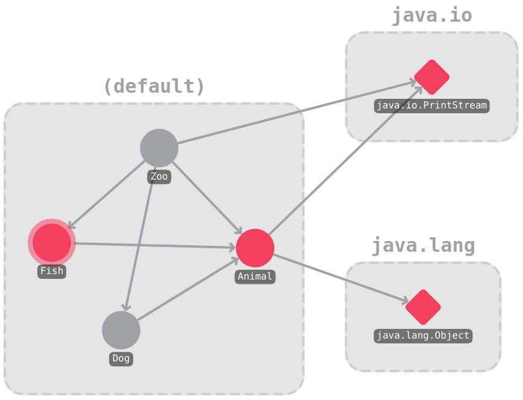
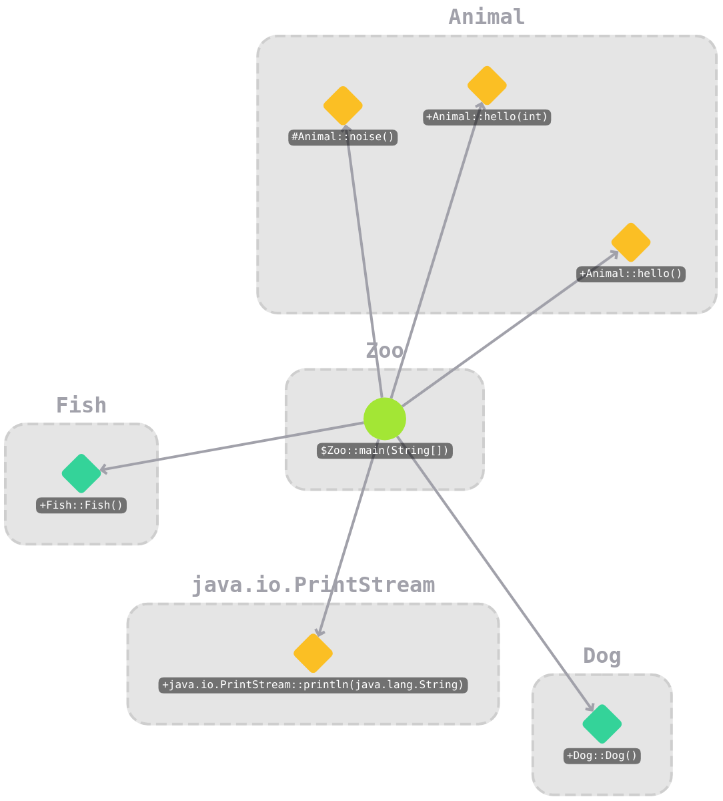

# `cat-viz`

`cat-viz` is an extension for Visual Studio Code that displays call graphs. It uses [`cat-server`](https://github.com/trettiofem/cat-server) as its backend, which in turn is based on [CAT](https://github.com/IdrissRio/cat/), a call graph analysis tool created by [Idriss Riouak](https://github.com/IdrissRio). CAT and by extension, cat-server is built on top of the [ExtendJ](https://extendj.org/) Java compiler.

## Table of Contents

- [Features](#features)
- [Usage](#usage)
- [License](#license)

## Features

- **Follow the flow of execution**: `cat-viz` highlights the flow of execution, allowing the user to get a good grasp of how the analyzed program is structured. Round nodes represent methods in files which are included in the analysis, while rhombus-shaped nodes represent methods in files which are not included in the analysis.

- **Zoom in and out**: `cat-viz` allows the user to "zoom" in and out of the graph, which shows the relationships, not only between methods, but also between classes and packages.

- **Selective analysis**: `cat-viz` allows for fine-tuning of its call graph analysis. Analyzing every file in a large project can take a long time to compute, and can result in a very large and unwieldy graph.

- **Search**: `cat-viz` has a built-in search function, allowing the user to search for methods, classes and packages.

## Usage

- **Starting the UI**: Open up the command palette (F1) and search for "Open Call Graph" and press enter. If `cat-server` is running and working, a new window will appear on the right. If you get an error, please ensure that `cat-server` is working correctly.
- **Adding dependencies**: Right-cliking on a .java file in the file explorer and selecting "Add Call Graph Dependency" adds the given file as a dependency. The user can also right-click on a folder or .jar file and select "Add to Call Graph Classpath" to add them as a class path dependency.
- **Setting the entry point**: Before call graph analysis can begin, the user must specify the entry point. This does not have to be the `main()` function, it could be any function. This is done within the `cat-viz` UI, by pressing the "Entry Point" button, and inputting a package and method name.
- **Call graph**: Call graph analysis is then performed by `cat-server` on the list of dependencies, yielding a call graph consisting of the files that the user has added, starting from the entry point. By right-clicking on a node you get additional information about that specific method. Nodes which are round are derived from files which are marked as dependencies, while rhombus-shaped nodes are not. Rhombus-shaped nodes whose path is local can be expanded, which causes them to be added to the list of dependencies.
- **Highlighting nodes**: Left-clicking on a node causes it to be highlighted, which shows all reachable nodes from the starting node. This is useful when you need to know how execution flows through the program, from a given start position.
- **Depth**: For large graphs, the graph may become rather unwieldy when looking at every single method. Therefore it is possible to switch the depth to "class" or "package", which shows the relationships between classes or packages. By right-clicking on a node in the "class" or "package" depth level and clicking expand, you can go up one level in order to view the contents within the given structure.

## License

`cat-viz` is released under the BSD 3-Clause License.